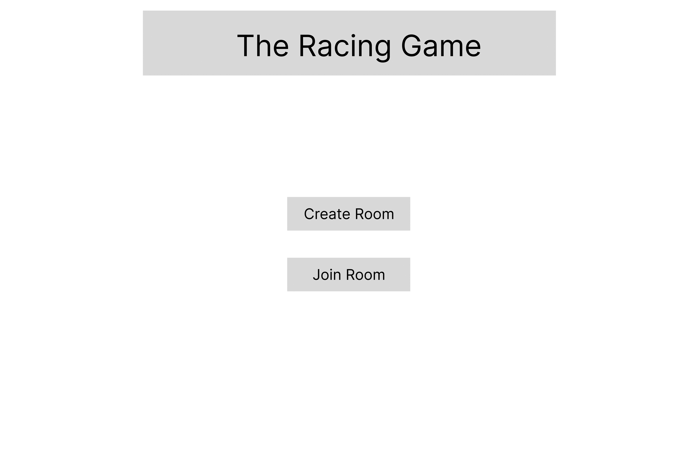
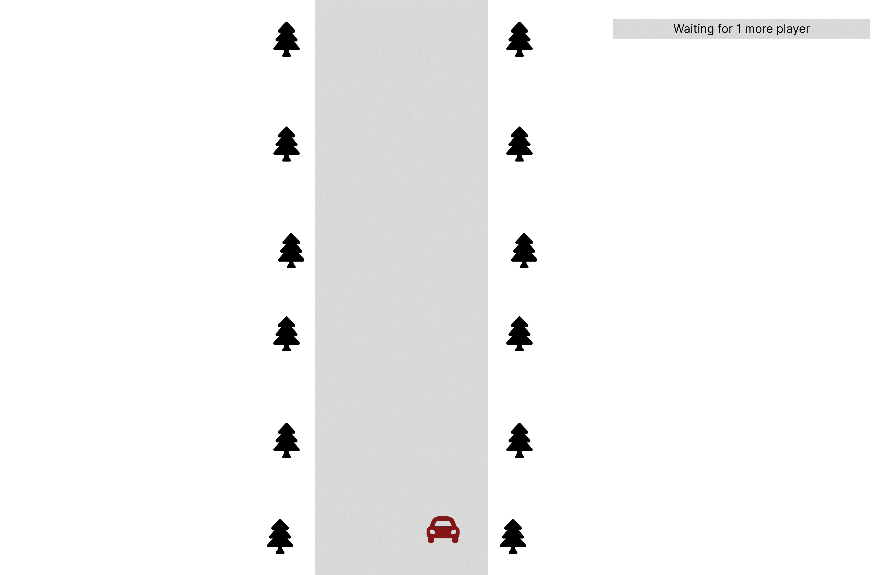
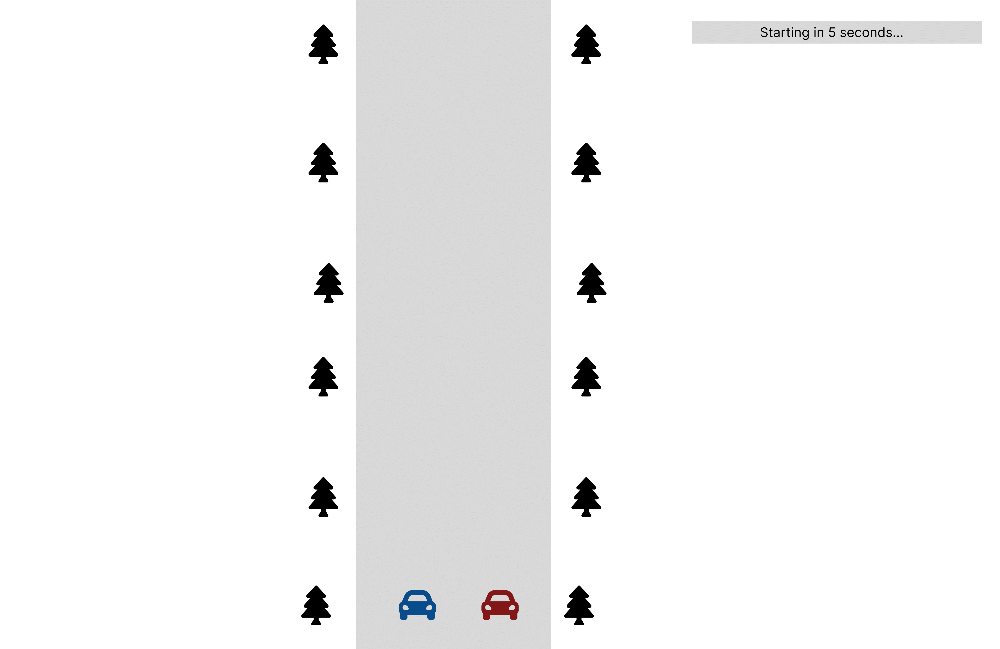
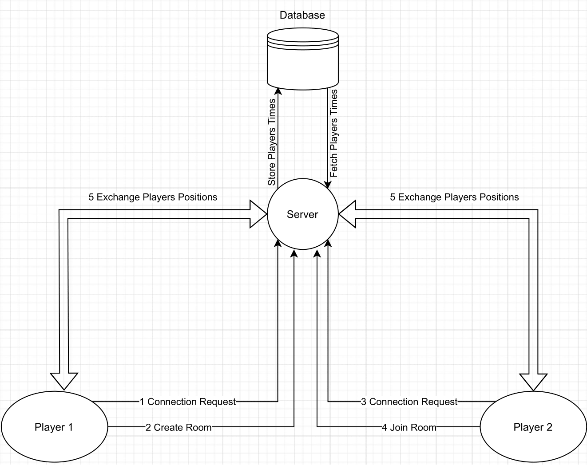
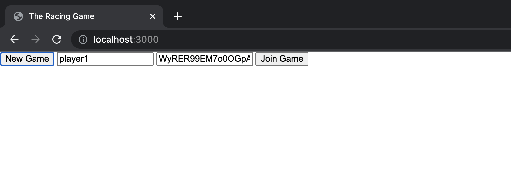
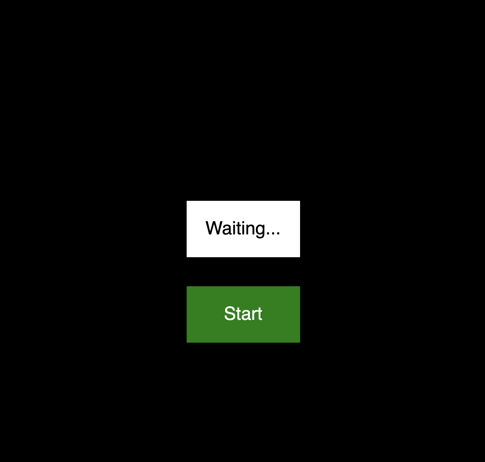
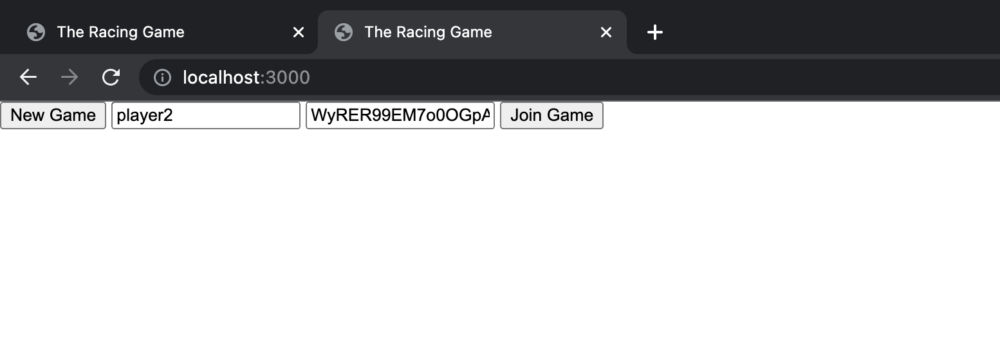
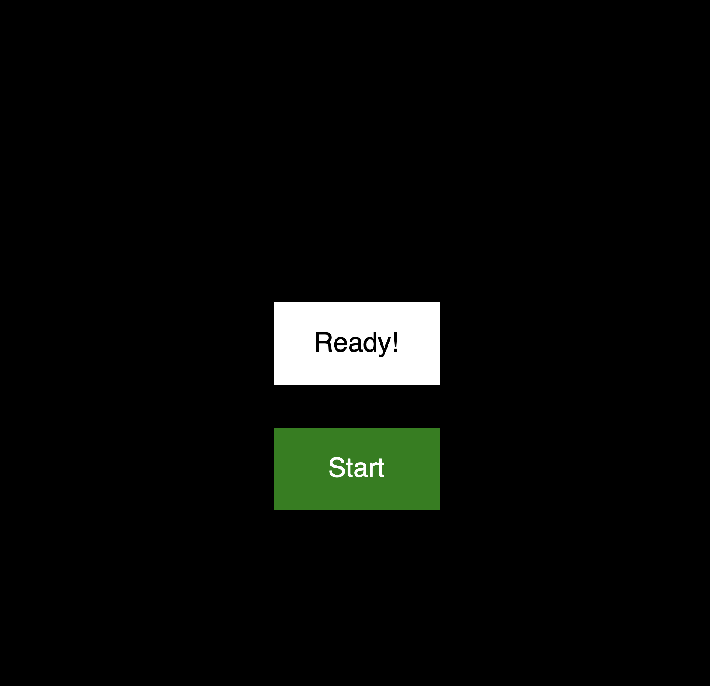

# Project 2: Racing Master

## Journey 1: Attempting to create a multiplayer racing game
### Concept
For this project, we will create a multiplayer racing game where players compete in a car race, and the one who finishes in the shortest time wins. To make the game more challenging and fun, obstacles will be included on the road to slow down players. At the end of the race, players’ names and times will be stored on the server. The names of 10 players with the shortest times will be displayed on the leaderboard. 


The homepage of our project has two options: “Create Room” and “Join Room.” When a user first creates a room, a socket connection is established between the server and the player. The game starts only when another player joins the same room. When the game starts, each player continuously shares their car’s location to the server which is then broadcasted to both players.

For the in-game interface, we will use a static background and move it in a loop from top to bottom, creating an illusion of “movement.” We generate random obstacle on the track to make it more dynamic. The number of obstacles will increase as the player progresses in the game.


### Planning
#### 1. Wireframes

*Homepage*


*After Create Room*


*After Join Room*


#### 2. Data Flow Diagram



### Process

We began to implement the socket communications between the server and clients. We wanted players to be able to create and join different rooms.

```javascript
// Listen to socket connection
io.on("connection", (socket) => {
    console.log("a user connected: ", socket.id);
    socket.on("disconnect", () => {
        console.log("user disconnected: ", socket.id);
    });

    // Listen to game initialization
    socket.on("init", async (data) => {
        // Log init
        console.log("init: ", data);

        // Create new game
        let game = await Game.createGame();
        // Emit game id
        socket.emit("init", game._id);
    });

    // Listen to player join event
    socket.on("player-join", async (data) => {
        let gameID = data.gameID;
        let player = {
            playerName: data.playerName,
            socketID: socket.id,
        };

        try {
            let game = await Game.getGame(gameID);
            game.addPlayer(player.playerName, player.socketID);
            await game.save();

            // Add player to the room
            socket.join(gameID);

            // Emit to all player of this game
            console.log("Player added to game");
            io.to(gameID).emit("player-join", {
                players: game.players,
            });
        } catch (err) {
            socket.emit("error", err);
        }
    });

```
*Player 1 creates a new room*


*Player 1 waits for player 2 to join*


*Player 2 joins a room*


*Game is ready to play*



## Journey 2: Creating a single-player racing game
After our attempto create a multiplayer racing game, we simplfied our game to a be single player. 


