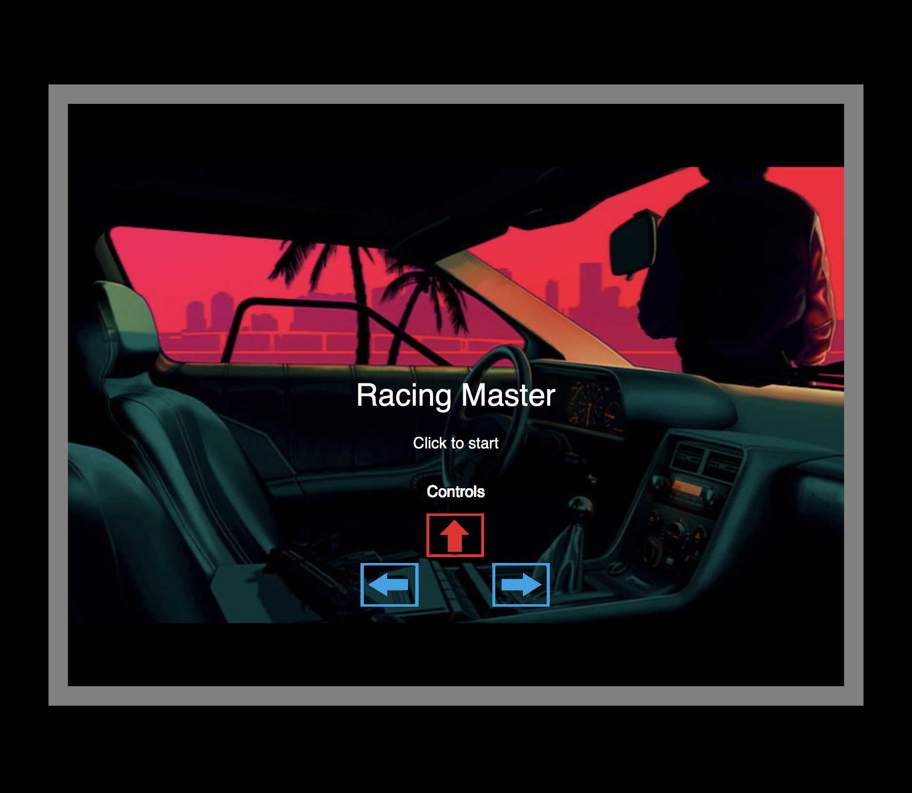

# Project 2: [Racing Master](https://instinctive-instinctive-mist.glitch.me)

## Journey 1: Attempting to create a multiplayer racing game
### Concept
For this project, we will create a multiplayer racing game where players compete in a car race, and the one who finishes in the shortest time wins. To make the game more challenging and fun, obstacles will be included on the road to slow down players. At the end of the race, players’ names and times will be stored on the server. The names of 10 players with the shortest times will be displayed on the leaderboard. 


The homepage of our project has two options: “Create Room” and “Join Room.” When a user first creates a room, a socket connection is established between the server and the player. The game starts only when another player joins the same room. When the game starts, each player continuously shares their car’s location to the server which is then broadcasted to both players.

For the in-game interface, we will use a static background and move it in a loop from top to bottom, creating an illusion of “movement.” We generate random obstacle on the track to make it more dynamic. The number of obstacles will increase as the player progresses in the game.


### Planning
#### 1. Wireframes

*Homepage*


*After Create Room*


*After Join Room*


#### 2. Data Flow Diagram


### Process

We began to implement the socket communications between the server and clients. We wanted players to be able to create and join different rooms.

```javascript
// Listen to socket connection
io.on("connection", (socket) => {
    console.log("a user connected: ", socket.id);
    socket.on("disconnect", () => {
        console.log("user disconnected: ", socket.id);
    });

    // Listen to game initialization
    socket.on("init", async (data) => {
        // Log init
        console.log("init: ", data);

        // Create new game
        let game = await Game.createGame();
        // Emit game id
        socket.emit("init", game._id);
    });

    // Listen to player join event
    socket.on("player-join", async (data) => {
        let gameID = data.gameID;
        let player = {
            playerName: data.playerName,
            socketID: socket.id,
        };

        try {
            let game = await Game.getGame(gameID);
            game.addPlayer(player.playerName, player.socketID);
            await game.save();

            // Add player to the room
            socket.join(gameID);

            // Emit to all player of this game
            console.log("Player added to game");
            io.to(gameID).emit("player-join", {
                players: game.players,
            });
        } catch (err) {
            socket.emit("error", err);
        }
    });

```
*Player 1 creates a new room*


*Player 1 waits for player 2 to join*


*Player 2 joins a room*


*Players ready to play*


Although we managed to create different lobbies for players to join, we faced bigger problems when it came to sharing data during the gameplay:
1. Update player's position on each side was difficult because we needed to render *p5js* elements based on where the other player is on the track
2. Collision would lag since the data would pass through the internet
3. The game's layout was not hard coded so the coordinates for one player on one client will be different for the other client

Thus, we decided to simplify our game to be single-player. After we successful built this version, we could upgrade it to be a multiplayer game. 

## Journey 2: Creating a single-player racing game
### [Preview](https://instinctive-instinctive-mist.glitch.me)
### Concept
The cocept for our revised game is very similar to the first version. The biggest change is that single-player, so players will not have to create and join a room. They will only need to enter their name and start the race!

During the race, obstacles will be randomly spawned on the track to add difficulty and fun to the game. To motivate players to be competitive, we will have a leaderboard that show top ten players who finished the race in the shortest times. 

### Process
#### Scoring
We started with a time-based scoring system: the longer a user remains in the game, the higher their score is. Soon, we realized that a person can start the game and not move their car at all and this will lead to them getting a very high score. We could have a method for updating the score only when the car is moving but instead we moved to coin based scoring system. So we made coin class which was completely based on obstacle class but with different behavior and image. 

```javascript
// Check if car is colliding with any obstacles
for (let i = 0; i < this.track.obstacles.length; i++) {
    if (this.track.obstacles[i].hasHit(this)) {
        GameOverScreen();
    }
}

// Check if car is colliding with any coins
for (let i = 0; i < this.track.coins.length; i++) {
    if (this.track.coins[i].hasHit(this)) {
        SOUNDS.coin_hit.play();

        this.track.coins.splice(i, 1);
        coinsCollected++;
    }
}
```


#### Sound
We added multiple sound feedbacks in our game. When the user first lands onto the `/game.html` page, a background music is played on loop. This sound effect added much better feeling of the game (as some of the tester noticed) compared to without sound. During the game play, the sound of the car engine is played on loop based on whether the car is "moving" (code below). When a user collects coin, another sound is played. Finally when the car hits an obstacle (blue cars), the user is taken to game-over screen where it plays a game over sound. 

Car movement sound:
```javascript
// If up key is pressed, move car
if (this.sketch.keyIsDown(this.sketch.UP_ARROW)) {
    this.move();

    // Stop Idle sound
    if (SOUNDS.car_idle.isPlaying()) {
        SOUNDS.car_idle.stop();
    }

    if (!SOUNDS.car_running.isPlaying()) {
        SOUNDS.car_running.play();
    }
} else {
    if (SOUNDS.car_running.isPlaying()) {
        SOUNDS.car_running.stop();
    }
    if (!SOUNDS.car_idle.isPlaying()) {
        SOUNDS.car_idle.play();
    }
}
```

#### Images
Initially all the objects were p5js shapes. We replaced those with `.png` images. One of the challenges (and also a limitation) was replacing the car's image itself. When we changed the p5js shapes for obstacles and coins to images, it worked fine. But using the same method, when we changed the car's shape to an image, collision detection system started to behave differently. We tried different strategies but none of them worked so we continued to use the original shape for the car. 


### Bishnu's Contributions and Challenges
I think most of the work in this project was done together. However, here are a few things that caught my interest and thus I focused more on those. The main challenge that I faced in this project was setting up the game mechanics. Moving the car and other objects on the track was difficult. Initially, I planned to change the coordinates of the car to make it move, but I soon figured out that I should be moving the track instead which would create the same effect as moving the car. Using this technique, the obstacles would be place relative to the track and when the track is moved, the obstacles will move as well. 

Track movement:
```javascript
// If UP key is pressed, move track
if (this.sketch.keyIsDown(this.sketch.UP_ARROW)) {
    this.y += this.velocity;
    this.velocity = Math.min(this.velocity + 0.01, this.maxVelocity);
} else {
    this.velocity = Math.max(this.velocity - 0.001, 0);
}
```

Relative Positioning of objects:
```javascript
// Similar implementation for obstacle and strides
this.sketch.image(
    IMAGES.coin,
    this.x + this.track.x - this.width / 2,
    this.track.y + this.y - this.height / 2,
    this.width,
    this.height
);
```


Furthermore, I also created three different screens (three different p5 instances: game-start, game-play, game-over) to make the design more modular. This made the process much easier as we wouldn't have to worry about re-initializing the objects if user pressed "play again" as creating a new instance will automatically discard old objects. Another challenge was the scoring system which is described above. I also configured the audio and images used in the game. For the homepage, I worked on the aesthetics and data communication between frontend and backend. Finally, I also put together each other's work and made necessary adjustment for proper integration. 

In terms of learning outcomes, I have learned a lot doing this project. From handling game threads to working with inner game logic, I got a glimpse of how games are really built from scratch without using any game engine. I discovered a lot of great resources that made it possible to build this game. One of the things I am incredibly proud of is how flawless the logic of the game was and its implementation. There was 0 bugs reported by the people I asked to test the game, although it was missing some feature (like the obstacle not moving, which was actually the intension).

### Pangna's Contributions and Challenges
It is really hard to decisively divide the contributions among ourselves since we worked together and helped each other debug many problems that came up. Thus, I will describe the parts that I spent the most time on. One of them that I focused on was setting up *neDB* to store and retrieve players' data. Players' scores and names are stored when they finished their races. Since only the top 10 players' data is stored in our database, I needed to sort, add, and remove new players' data. I needed to check every new score with the previous records to make sure that I removed the lowest score and did not mess up the database.

*Setup neDB*
```javascript
// import nedb
const Datastore = require("nedb");

// setup nedb
const db = new Datastore({
    filename: "data.db",
    autoload: true,
    timestampData: true,
});
```

*Server: get and save high scores*
```javascript
let currentHighScore = 0;

// Get high score
db.find({})
    .sort({ score: -1 })
    .limit(1)
    .exec((err, docs) => {
        if (err) {
            res.status(500).send(err);
        } else {
            if (docs.length > 0) {
                currentHighScore = docs[0].score;
            }

            // Save score and name to db
            db.insert({ name, score }, (err, newDoc) => {
                if (err) {
                    res.status(500).send(err);
                } else {
                    res.send({
                        ...newDoc,
                        highScore: Math.max(currentHighScore, score),
                        highScoreBroken: score > currentHighScore,
                    });
                }
            });
        }
    });
```
*Client: Send data to server*
```javascript
const SubmitScore = () => {
    // get score
    let score = coinsCollected;
    // post score
    fetch("/api/scores", {
        method: "POST",
        headers: {
            "Content-Type": "application/json",
        },
        body: JSON.stringify({
            name: playerName,
            score: score,
        }),
    })
        .then((res) => res.json())
        .then((data) => {
            scoreResponse = data;
            console.log(data);
        })
        .catch((err) => {
            console.log(err);
        });
};
```

After setting up our database, I also helped with the collision detection system in our game. The logic was to check whether is within the coordinates of the obstacles and coins on the track. Thus, I used the car's x coordinate with its width and the car's y coordinate with its height to check whether it comes in contact with other objects. This algorithm worked well we drew the car using various shapes. However, we replaced it with a car image, the collosion detection became unreliable. The derived function is below:

```javascript
 hasHit(car) {
    // Check if car has hit obstacle
    if (
        car.x + car.width / 2 >= this.x + this.track.x - this.width / 2 &&
        car.x - car.width / 2 <= this.x + this.track.x + this.width / 2 &&
        car.y + car.height / 2 >= this.track.y + this.y - this.height / 2 &&
        car.y - car.height / 2 <= this.track.y + this.y + this.height / 2
    ) {
        return true;
    }
}
```

In addition, I assisted with spawing random obstacles and coins on the track. Spawning random objects on *p5js* canvas was easy, but making sure that they do not overlap was another story. I needed to tried different range values to be randomized in order to make the obstacles and coins spawn randomly and not overlapped. Besides trying differernt randomized values, a function was implemented to check that a coin won't overlap an obstacle when spawned. For the obstacles, it is important that is enough space for the car to navigate through. 

```javascript
 // Randomly generate coins
for (let i = 0; i < Math.floor((5 / 1000) * this.height); i++) {
    let xRange = [15, this.width - 15];
    let yRange = [0, this.height - sketch.height];

    let coinX, coinY;

    // Check if coin is not overlapping with obstacle
    let overlapping;
    do {
        coinX = sketch.random(xRange[0], xRange[1]);
        coinY = sketch.random(yRange[0], yRange[1]);
        overlapping = false;
        for (let j = 0; j < this.obstacles.length; j++) {
            let obstacle = this.obstacles[j];
            let d = sketch.dist(coinX, coinY, obstacle.x, obstacle.y);
            if (d < obstacle.height) {
                overlapping = true;
            }
        }
    } while (overlapping);

    let coin = new Coin(sketch, coinX, coinY, _this);
    this.coins.push(coin);
}
```
Regarding the *HTML* apsect, I helped with customizing and updaing the table in the homepage to display the top 10 players on the leaderboard. Thus, there is a new top-ten highscore, the table will get updated. I also had fun with styling the apperance of our webpage. 

Overall, this project allowed me to apply new concepts that we learned in class, like neDB and advanced *p5js* functions, to create a game that everyone can enjoy. After spending time conceptualizing, planning, implmenting, and debugging our game, I was so proud that many people played and provided us with many positive and constructive feedback. 

### Our Game
*Hompage*


*Intruction page*


*In-game page*


[Play now!](https://instinctive-instinctive-mist.glitch.me)

### Overall Challenges
- Collision detection: Difficult to detect when car collides with obstacles. 
- Multiplayer: Syncing & Relative positioning of item on canvas was difficult
- Overlapping objects: Difficult to spawn items without overlapping
- Designing track: Placing strides on the track was difficult.

### Current Game's Limtations
- Single player
- Car's physics: Car's acceleratoin is not realstic, like the car comes to a sudden stop when the control is released
- Idle obstacles: Obstacles like cars should be moving toward the player's instead of being stationary

### Lessons Learned
- Learned to use p5js sound addon, p5 instance, & images
- Learned to create glowing Animations
- Learned to use localStorage
- Learned to use linear gradient.

### Future Updates
- Multiplayer: Allow multiplayer competitions
- 3D Version: Create 3D version of the game.
- Car Physics: Add proper car physics: acceleration, braking, steering
- Dynamic Obstacles: Add obstacle movement on the track
- Performance: Reduce loading time in-between screens.

### Resources Used:

1. Kilobolt.com
2. Soundsnap.com (for all audio files)
3. deviantart.com: [BG Image](https://www.deviantart.com/rhoogers/art/Hotline-Miami-Fan-art-522628505)

Most other images were based on blueprints and were edited on an image editor to produce the ones used in the game.
